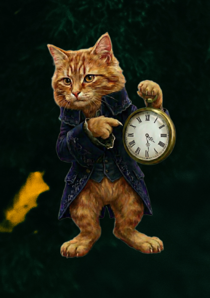

# katoclock

Just a QML-only cat clock widget for KDE Plasma 6. Bootstrapped from my [kde-6-widget-starter](https://github.com/ruinivist/kde-6-widget-starter)

[Pling page](https://www.pling.com/p/2349620/)

# Install

- clone the repo
- `make install` from repo root

# Package

- `make package` builds a `.plasmoid` archive from the QML package and bundled image assets
